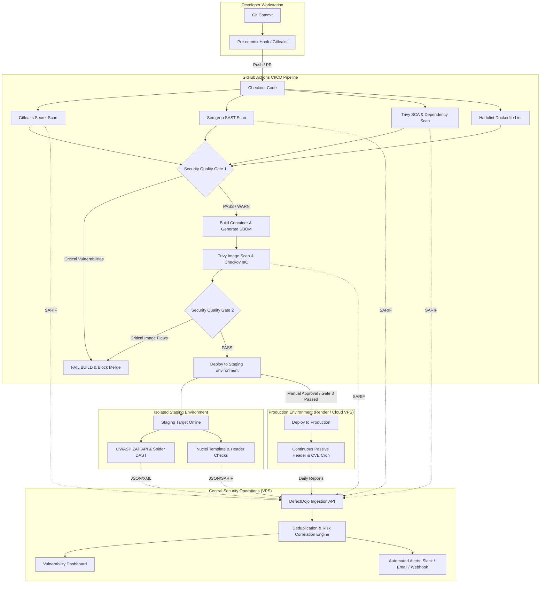

# DevSecOps Security Pipeline Architecture & Decision Framework

This document analyzes the four fundamental architectural approaches for automated security auditing across full-stack production environments and provides the detailed engineering blueprint for the selected **Hybrid DevSecOps Pipeline**.

---

## 1. Architectural Comparison & Trade-Off Analysis

```
┌─────────────────────────────────────────────────────────────────────────────────────────────────┐
│                                   ARCHITECTURAL OPTIONS EVALUATED                               │
├──────────────────┬──────────────────┬────────────────────┬──────────────────────────────────────┤
│ Option           │ Infrastructure   │ Security Strength  │ Primary Drawback                     │
├──────────────────┼──────────────────┼────────────────────┼──────────────────────────────────────┤
│ Architecture A   │ GitHub CI Only   │ High Shift-Left    │ No continuous runtime DAST/VPS audit │
│ Architecture B   │ Unified Platform │ Consolidated UI    │ Vendor lock-in; tool capability gaps │
│ Architecture C   │ VPS Scanners     │ Runtime Context    │ Late detection; impacts production   │
│ Architecture D   │ Hybrid Pipeline  │ Defense-in-Depth   │ Requires initial orchestration setup │
└──────────────────┴──────────────────┴────────────────────┴──────────────────────────────────────┘
```

### Architecture A: Pure GitHub Actions Pipeline
- **Flow**: Developer Push → Git Hook → SAST (Semgrep) → Secrets (Gitleaks) → SCA/Deps (Trivy) → Container/IaC (Hadolint/Trivy) → Build → Deploy → End.
- **Pros**: Zero additional hosting cost; blocks vulnerable code before it ever reaches a server.
- **Cons**: Cannot perform dynamic runtime authentication fuzzing, API vulnerability testing, or track live deployed asset drift without external staging targets.

### Architecture B: Monolithic All-In-One Security Platform
- **Flow**: Code & Target sent to a single vendor scanner.
- **Pros**: Single configuration file.
- **Cons**: "Jack of all trades, master of none." No single tool performs best-in-class SAST, DAST, Secret entropy detection, container CVE scanning, and policy enforcement simultaneously.

### Architecture C: Pure VPS Runtime Scanner
- **Flow**: Cron jobs on the production VPS execute scanners against localhost.
- **Pros**: Direct visibility into running processes and open ports.
- **Cons**: High risk of resource exhaustion or database corruption during active scans; discovers vulnerabilities *after* code is already exposed to public traffic.

### Architecture D (SELECTED): Hybrid Shift-Left CI + Dynamic Staging DAST + Central DefectDojo Dashboard
- **Flow**:
  1. **Pre-Commit / Pull Request (Shift-Left)**: Fast, non-destructive static analysis (Semgrep, Gitleaks, Trivy SCA, Hadolint) executes in GitHub Actions. Pull requests with `CRITICAL` flaws are blocked immediately.
  2. **Build & Container Verification**: Container images and IaC manifests are scanned for CVEs and misconfigurations via Trivy & Checkov. CycloneDX SBOM is generated.
  3. **Staging Dynamic Security Audit (DAST)**: On deployment to the isolated staging environment, OWASP ZAP (API and authenticated spider) and Nuclei run automated security tests against live staging endpoints.
  4. **Central Correlation & Vulnerability Management**: All scan artifacts (SARIF and JSON) are automatically uploaded to a self-hosted **OWASP DefectDojo** instance running on the internal ops network. DefectDojo normalizes, deduplicates, and tracks MTTR (Mean Time to Remediate).
  5. **Safe Production Monitoring**: Production environment receives only non-destructive passive TLS/Header inspections and dependency CVE refreshes on a daily schedule.

---

## 2. End-to-End Hybrid Architecture Flowchart



---

## 3. Security Event Trigger Matrix

| Event Trigger | Executed Security Scans | Environment Target | Blocking Behavior |
| :--- | :--- | :--- | :--- |
| **Pull Request to `main`** | Gitleaks + Semgrep + Trivy SCA + Hadolint | GitHub Runner (Static) | **BLOCKS PR** if CRITICAL/HIGH found |
| **Merge / Push to `main`** | Full SAST + Container Build + Trivy Image Scan + SBOM | GitHub Runner (Static) | **BLOCKS DEPLOY** if CRITICAL found |
| **Staging Deployment** | OWASP ZAP API Scan + Nuclei Template Audit | Staging URL (Dynamic) | **BLOCKS PROD PROMOTION** on CRITICAL DAST |
| **Nightly Schedule (02:00 IST)** | Dependency CVE Database Refresh + Trivy FS + Nuclei Passive | Codebase + Staging | Dispatches Slack/Email Digest |
| **Emergency Manual Dispatch** | Full-Stack Pipeline with Verbose Debug Payloads | Selected Environment | Interactive Report Generation |
